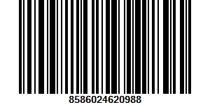

# FoodTrack – Android Táplálkozás követő Alkalmazás

Szia! Probléma esetén kérlek írj CooSpacen (Szente Zsolt - LFGISW). Összegyűjtöttem a főbb követelmények megvalósításait, hogy könnyebben megtaláld a kódban. Ha találsz hibát, megköszönném ha megírnád, sajnos az értékelést ugye nem látjuk..

---

### Firebase autentikáció

- Regisztráció: `RegisterActivity.java` – **65. sor**
- Belépés: `MainActivity.java` – **60. sor**

---

### Adatmodell

- `UserProfile.java` – felhasználói adatok tárolása
- `MealLogItem.java` – naplózott ételek adatai

---

### Legalább 4 különböző Activity
- `DashboardActivity.java`
- `ItemLogActivity.java`
- `MainActivity.java`
- `MealLogActivity.java`
- `ProfileActivity.java`
- `RegisterActivity.java`

---

### Különböző Layout típusok
- `ConstraintLayout`: legtöbb layout fájlban
- `LinearLayout`: `activity_profile.xml` – **44. sor**
- `CardView`: `item_meal_card.xml`

---

### Két különböző animáció
- `MainActivity.java` – **45. sor**
- `MealLogActivity.java` – **174. sor**

---

### Lifecycle Hook használat
- `onSaveInstanceState()`: `DashboardActivity.java` – **498. sor**
- `onPause()`: `MainActivity.java` – **124. sor**
- `onResume()`: `MainActivity.java` – **131. sor**

---

### Android erőforrás használata (Permission)

- `CAMERA`
   - `AndroidManifest.xml` – **10. sor**
   - `ItemLogActivity.java` – **198. sor**, **220. sor**

- `POST_NOTIFICATIONS`
   - `AndroidManifest.xml` – **9. sor**
   - `DashboardActivity.java` – **116-124. sor**

---

### Háttérszolgáltatások
- **Notification**: `NotificationHelper.java`, `DashboardActivity.java` - **365. sor** (**393,396**)
- **Alarm Manager**: `AlarmReceiver.java`, `AlarmUtils.java`, `DashboardActivity.java` – **123., 124. sor**

---

### CRUD műveletek
- **Create**: `ItemLogActivity.java` – **182. sor**
- **Read**: `ProfileActivity.java` – **265. sor**
- **Update**: `ItemLogActivity.java` – **172. sor**
- **Delete**: `ProfileActivity.java` – **245. sor**

---

### Firestore lekérdezések (indexet igénylő)

- `DashboardActivity.java` – **216. sor**  
- `ItemLogActivity.java` – **109. sor**  
- `ItemLogActivity.java` – **246. sor**  
- `MealLogActivity.java` – **89. sor**

---

### Ha a vonalkód beolvasását szeretnéd tesztelni telefonnal, itt az egyik termék vonalkódja:

